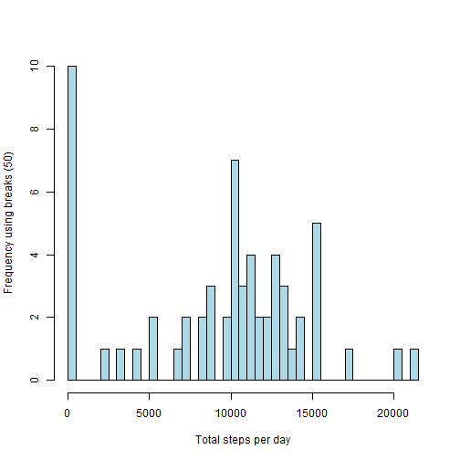
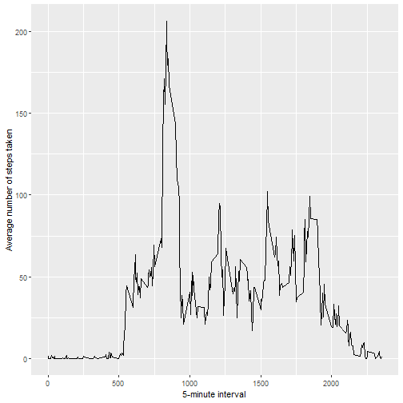
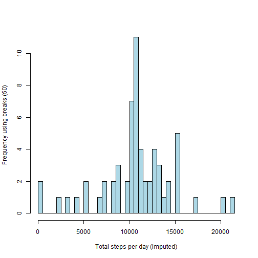
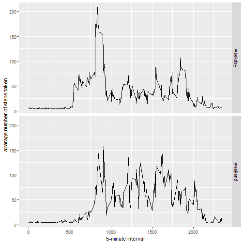

# Reproducible Research: Peer Course Project 1


```r
library(ggplot2)
library(scales)
library(Hmisc)
```

## Loading and preprocessing the data
##### Load the data (i.e. read.csv())

```r
if(!file.exists('activity.csv')){
    unzip('activity.zip')
}
activity_movement <- read.csv('activity.csv')
```


## What is mean total number of steps taken per day?

```r
Total_Steps_Per_Day <- tapply(activity_movement$steps, activity_movement$date, 
                              sum, na.rm=TRUE)
```

##### Make a histogram of the total number of steps taken each day

```r
hist(Total_Steps_Per_Day, col="lightblue", breaks = 50,xlab='Total steps per day'
     , ylab='Frequency using breaks (50)', main = "")
```



##### Calculate and report the mean and median total number of steps taken per day

```r
Avg_For_Total_Steps_Per_Day <- mean(Total_Steps_Per_Day)
Median_For_Total_Steps_Per_Day <- median(Total_Steps_Per_Day)
```

* Mean: 9354.2295082
* Median:  10395

-----

## What is the average daily activity pattern?

```r
averageStepsPerTimeBlock <- aggregate(x=list(Average_Number_Of_Steps_By_Interval=activity_movement$steps), by=list(interval=activity_movement$interval), FUN=mean, na.rm=TRUE)
```

##### Make a time series plot

```r
ggplot(data=averageStepsPerTimeBlock, aes(x=interval, 
                                          y=Average_Number_Of_Steps_By_Interval)) +
    geom_line() +
    xlab("5-minute interval") +
    ylab("Average number of steps taken") 
```



##### Which 5-minute interval, on average across all the days in the dataset, contains the maximum number of steps?

```r
Max_Steps_Per_Avg_5minute_Interval <- which.max(averageStepsPerTimeBlock$Average_Number_Of_Steps_By_Interval)
```

* Maximum Number Of Steps: 104

----

## Imputing missing values

##### Calculate and report the total number of missing values in the dataset 

```r
Total_Missing_Value_Rows <- length(which(is.na(activity_movement$steps)))
```

* Number of missing values: 2304

##### Devise a strategy for filling in all of the missing values in the dataset & create a new dataset that is equal to the original dataset but with the missing data filled in.


```r
activity_movementImputed <- activity_movement
activity_movementImputed$steps <- impute(activity_movement$steps, fun=mean)
```


##### Make a histogram of the total number of steps taken each day 

```r
Total_Steps_Per_Day_Imputed <- tapply(activity_movementImputed$steps, activity_movementImputed$date, sum)
hist(Total_Steps_Per_Day_Imputed, col="lightblue", breaks = 50,xlab='Total steps per day (Imputed)', ylab='Frequency using breaks (50)', main = "")
```



##### ... Calculate and report the mean and median total number of steps taken per day. 

```r
Avg_For_Total_Steps_Per_Day_Imputed <- mean(Total_Steps_Per_Day_Imputed)
Median_For_Total_Steps_Per_Day_Imputed <- median(Total_Steps_Per_Day_Imputed)
```
* Mean   (Imputed):  1.0766189 &times; 10<sup>4</sup>
* Median (Imputed):  1.0766189 &times; 10<sup>4</sup>


----

## Are there differences in activity patterns between weekdays and weekends?

##### Create a new factor variable in the dataset with two levels – “weekday” and “weekend” indicating whether a given date is a weekday or weekend day.


```r
activity_movementImputed$DayType <-  factor(ifelse(weekdays(as.POSIXlt(activity_movementImputed$date)) 
                                                   %in% c("Saturday","Sunday"), 'weekend', 'weekday'))
```

##### Make a panel plot containing a time series plot


```r
averagedactivity_movementImputed <- aggregate(steps ~ interval + DayType, data=activity_movementImputed, mean)
ggplot(averagedactivity_movementImputed, aes(interval, steps)) + 
    geom_line() + 
    facet_grid(DayType ~ .) +
    xlab("5-minute interval") + 
    ylab("avarage number of steps taken")
```


